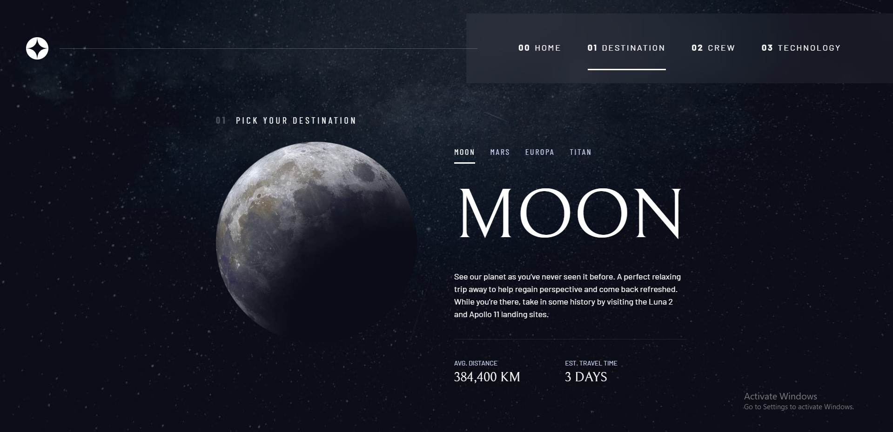

# Frontend Mentor - Space tourism website solution

This is a solution to the [Space tourism website challenge on Frontend Mentor](https://www.frontendmentor.io/challenges/space-tourism-multipage-website-gRWj1URZ3). Frontend Mentor challenges help you improve your coding skills by building realistic projects.

## Table of contents

- [Overview](#overview)
  - [The challenge](#the-challenge)
  - [Screenshot](#screenshot)
  - [Links](#links)
- [My process](#my-process)
  - [Built with](#built-with)
  - [What I learned](#what-i-learned)
  - [Continued development](#continued-development)
  - [Useful resources](#useful-resources)
- [Author](#author)
- [Acknowledgments](#acknowledgments)

**Note: Delete this note and update the table of contents based on what sections you keep.**

## Overview

### The challenge

Users should be able to:

- View the optimal layout for each of the website's pages depending on their device's screen size
- See hover states for all interactive elements on the page
- View each page and be able to toggle between the tabs to see new information

### Screenshot



### Links

- Solution URL: [Add solution URL here](https://your-solution-url.com)
- Live Site URL: [Add live site URL here](https://your-live-site-url.com)

## My process

### Built with

- Semantic HTML5 markup
- CSS custom properties
- Flexbox
- CSS Grid
- Mobile-first workflow
- [React](https://reactjs.org/) - JS library
- [Next.js](https://nextjs.org/) - React framework
- [Styled Components](https://styled-components.com/) - For styles

**Note: These are just examples. Delete this note and replace the list above with your own choices**

### What I learned

```html
<h1>Some HTML code I'm proud of</h1>
```

```css
:root {
  /* use it in hsl with combining with alpha value after forward slash */
  --clr-dark: 230 35% 7%;
  /* clamp(min-value, middle-value, max-value) so it depends viewport */
  --fs-900: clamp(5rem, 8vw + 1rem, 9.375rem);
  --ff-serif: "Bellefair", serif;
}

body {
  /* so can be use css variable in hsl */
  color: hsl(var(--clr-white));
  background-color: hsl(var(--clr-dark));
  /* min-content takes min size */
  grid-template-rows: min-content 1fr;
}

input,
button,
textarea,
select {
  /* so we can use without applying font-family */
  font: inherit;
}

/* on mac there is an option to change it */
/* remove animation for people who've turned them off */
@media (prefers-reduced-motion: reduce) {
  *,
  *::before,
  *::after {
    animation-duration: 0.01ms !important;
    animation-iteration-count: 1 !important;
    transition-duration: 0.01ms !important;
    scroll-behavior: auto !important;
  }
}

.grid {
  /* use utility class as .flex in container element */
  display: grid;
  /* this variable with a default or backup value provide inline css usage
  as style="--gap: 2rem;"  so we do not need initialize --gap value here*/
  gap: var(--gap, 1rem);
}

.d-block {
  display: block;
}

/* flow > * + * add margin to any child except has no adjacent sibling before */
/* can be used also .flow > *:not(:first-child) */
/* new css selectors: :is(el, el, ...) > p means each p in any el element */
/* new css selectors: :where() */
.flow > *:where(:not(:first-child)) {
  /* --flow-space is now undefines, so use 1rem but we define it in inline styling */
  margin-top: var(--flow-space, 1rem);
}

.container {
  /* instead of margin only left and right values */
  padding-inline: 2em;
  margin-inline: auto;
}

.grid-container {
  /* shorthand: align-items justify-content */
  place-items: center;
}

.grid-container > * {
  /* ch is equal of width of 0 value */
  max-width: 50ch;
}

@media (min-width: 45rem) {
  .grid-container {
    grid-template-columns: minmax(1rem, 1fr) repeat(2, minmax(0, 30rem)) minmax(1rem, 1fr);
  }

  .grid-container--home {
    /* another solution max(first-value, second-value) so it takes max value of them */
    /* padding-bottom: max(10vw, 150px); : At least 10vw or 150px */
    padding-bottom: max(6rem, 20vh);
  }
}

.sr-only {
  position: absolute;
  width: 1px;
  height: 1px;
  padding: 0;
  margin: -1px;
  overflow: hidden;
  clip: rect(0, 0, 0, 0);
  white-space: nowrap;
  /* Added line */
  border: 0;
}

.bg-dark {
  background-color: hsl(var(--clr-dark));
}

.large-button {
  display: inline-grid;
  /* align-items and justify-items: can be take a two value as place-items: center flex-start */
  place-items: center;
  /* aspect-ratio: width height; */
  aspect-ratio: 1;
}

.large-button:hover::after,
.large-button:focus::after {
  /* transform does not force the browser redraw objects so use it instead of width, height etc. */
  transform: scale(1.5);
}

  .primary-navigation {
    /* min(first-value, second-value) : Choose the smallest reference */
    padding: min(10rem, 3vh) 2rem;
    background: hsl( var(--clr-white) / 0.05);
    backdrop-filter: blur(1.5rem);
  }

  /* browser support */
  /* if browser does not support backdrop-filter apply dark background*/
  /* must be provided key and value, because some browsers may not support some units */
  @supports not (backdrop-filter: blur(1.5rem)) {
    .primary-navigation {
      background: hsl( var(--clr-dark) / .9);
    }
  }

  @media (max-width: 35rem) {
    .primary-navigation {
      /* shorthand of top right bottom left */
      inset: 0 0 0 20%;
      /* min(first-value, second-value) : Choose the smallest reference */
      padding: min(10rem, 3vh) 2rem;
    }
  }
```

```js
const proudOfThisFunc = () => {
  console.log("🎉");
};
```

### Continued development

Use this section to outline areas that you want to continue focusing on in future projects. These could be concepts you're still not completely comfortable with or techniques you found useful that you want to refine and perfect.

### Useful resources

- [Example resource 1](https://www.example.com) - This helped me for XYZ reason. I really liked this pattern and will use it going forward.
- [Example resource 2](https://www.example.com) - This is an amazing article which helped me finally understand XYZ. I'd recommend it to anyone still learning this concept.

## Author

- Website - [Add your name here](https://www.your-site.com)
- Frontend Mentor - [@yourusername](https://www.frontendmentor.io/profile/yourusername)
- Twitter - [@yourusername](https://www.twitter.com/yourusername)

## Acknowledgments

This is where you can give a hat tip to anyone who helped you out on this project. Perhaps you worked in a team or got some inspiration from someone else's solution. This is the perfect place to give them some credit.
